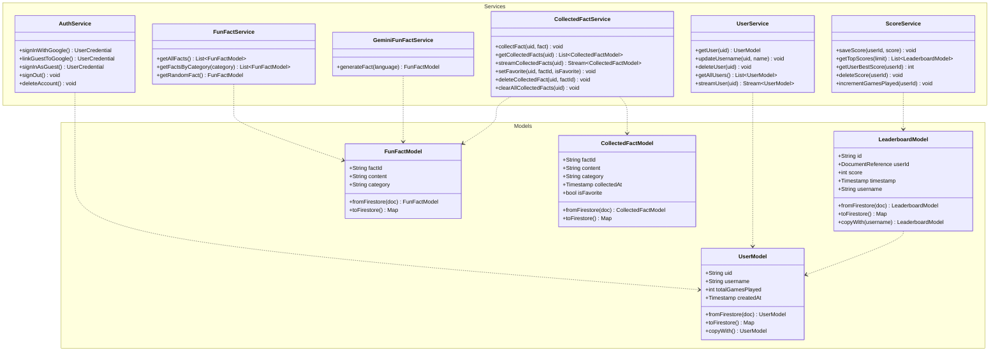
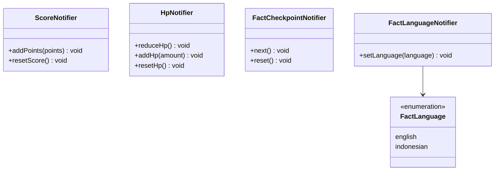

# Class Diagram — JumPedia (Core: Model · Service · Provider)

Diagram ini memetakan lapisan inti arsitektur JumPedia: **Model** (struktur data
Firestore), **Service** (operasi CRUD ke Firestore & integrasi AI), dan
**Provider** (Riverpod, penghubung antara UI dan service/state).

Pola umum yang dipakai:

- **Model** — kelas data immutable; tiap model punya `fromFirestore()` dan
  `toFirestore()` (kecuali model yang di-generate AI). `UserModel` &
  `LeaderboardModel` punya `copyWith()`.
- **Service** — kelas tanpa state yang membungkus Firestore / Gemini.
- **Provider** — singleton `Provider` untuk service, `StateNotifierProvider`
  untuk state runtime (skor, HP, bahasa, checkpoint), dan `FutureProvider` /
  `StreamProvider` untuk data async.

---

## 1. Versi Mermaid

> Bisa langsung dirender di GitHub, VS Code (ekstensi Mermaid), atau
> <https://mermaid.live>.



### Runtime State (Riverpod) — diagram terpisah

> Dipisah agar garis tidak menyilang ke Service/Model. Notifier ini dipakai
> oleh GameWorld & UI (di luar lapisan data), bukan oleh Service.



---

## 2. Versi PlantUML

```plantuml
@startuml JumPedia_Core
skinparam classAttributeIconSize 0
skinparam linetype ortho
hide empty members

package "Models" {
  class UserModel {
    +String uid
    +String username
    +int totalGamesPlayed
    +Timestamp createdAt
    +{static} fromFirestore(doc) : UserModel
    +toFirestore() : Map
    +copyWith(...) : UserModel
  }

  class LeaderboardModel {
    +String? id
    +DocumentReference userId
    +int score
    +Timestamp timestamp
    +String? username
    +{static} fromFirestore(doc) : LeaderboardModel
    +toFirestore() : Map
    +copyWith(username) : LeaderboardModel
  }

  class FunFactModel {
    +String factId
    +String content
    +String category
    +{static} fromFirestore(doc) : FunFactModel
    +toFirestore() : Map
  }

  class CollectedFactModel {
    +String factId
    +String content
    +String category
    +Timestamp collectedAt
    +bool isFavorite
    +{static} fromFirestore(doc) : CollectedFactModel
    +toFirestore() : Map
  }
}

package "Services" {
  class AuthService {
    -FirebaseAuth _auth
    -GoogleSignIn _googleSignIn
    -FirebaseFirestore _firestore
    +authStateChanges : Stream<User?>
    +currentUser : User?
    +signInWithGoogle() : UserCredential?
    +linkGuestToGoogle() : UserCredential?
    +signInAsGuest() : UserCredential?
    +signOut() : void
    +deleteAccount() : void
  }

  class UserService {
    -FirebaseFirestore _firestore
    +getUser(uid) : UserModel?
    +updateUsername(uid, newUsername) : void
    +deleteUser(uid) : void
    +getAllUsers() : List<UserModel>
    +streamUser(uid) : Stream<UserModel?>
  }

  class ScoreService {
    -FirebaseFirestore _firestore
    +saveScore(userId, score) : void
    +getTopScores(limit) : List<LeaderboardModel>
    +getUserBestScore(userId) : int
    +deleteScore(userId) : void
    +incrementGamesPlayed(userId) : void
  }

  class FunFactService <<legacy>> {
    -FirebaseFirestore _firestore
    +getAllFacts() : List<FunFactModel>
    +getFactsByCategory(category) : List<FunFactModel>
    +getRandomFact() : FunFactModel?
  }

  class GeminiFunFactService {
    -GenerativeModel? _model
    -String? _lastTopic
    -List<String> _recentFacts
    +generateFact(language) : FunFactModel
    -pickTopic() : String
    -promptFor(topic, language) : String
    -rememberFact(fact) : void
    -fallbackFact(language) : FunFactModel
  }

  class CollectedFactService {
    -FirebaseFirestore _firestore
    +collectFact(uid, fact) : void
    +getCollectedFacts(uid) : List<CollectedFactModel>
    +streamCollectedFacts(uid) : Stream<List<CollectedFactModel>>
    +setFavorite(uid, factId, isFavorite) : void
    +deleteCollectedFact(uid, factId) : void
    +clearAllCollectedFacts(uid) : void
  }
}

package "Providers (Riverpod)" {
  class ScoreNotifier {
    +addPoints(points) : void
    +resetScore() : void
    +currentScore : int
  }
  class HpNotifier {
    +reduceHp() : void
    +addHp(amount) : void
    +resetHp() : void
    +isGameOver : bool
  }
  class FactCheckpointNotifier {
    +next() : void
    +reset() : void
  }
  class FactLanguageNotifier {
    -SharedPreferences _prefs
    +setLanguage(language) : void
  }
  enum FactLanguage {
    english
    indonesian
    --
    +label : String
    +promptName : String
  }
}

' ── Service menghasilkan / memetakan Model ──
UserService ..> UserModel : maps
ScoreService ..> LeaderboardModel : maps
FunFactService ..> FunFactModel : maps
GeminiFunFactService ..> FunFactModel : creates
CollectedFactService ..> CollectedFactModel : maps
CollectedFactService ..> FunFactModel : reads on create
AuthService ..> UserModel : creates doc

' ── Relasi antar model ──
LeaderboardModel ..> UserModel : userId (DocumentReference)

' ── Provider/Notifier ──
GeminiFunFactService ..> FactLanguage : uses
FactLanguageNotifier --> FactLanguage : holds

note bottom of GeminiFunFactService
  Sumber fun fact AKTIF (AI Gemini 2.5-flash-lite).
  FunFactService (Firestore) = legacy, tidak lagi
  dipakai oleh overlay sejak migrasi ke AI.
end note

@enduml
```

> Render via <https://www.plantuml.com/plantuml> atau plugin PlantUML di IDE.



---

## 3. Catatan relasi (untuk penjelasan di laporan)

| Relasi | Penjelasan |
|---|---|
| `Service ..> Model` | Service memetakan dokumen Firestore ↔ objek Model (`fromFirestore` / `toFirestore`). |
| `GeminiFunFactService ..> FunFactModel` | Tidak baca DB — meng-**generate** `FunFactModel` baru dari teks AI (atau fakta cadangan bila AI gagal). |
| `CollectedFactService ..> FunFactModel` | Saat `collectFact()`, menerima `FunFactModel` (hasil AI) lalu menyimpannya sebagai `CollectedFactModel`. |
| `LeaderboardModel ..> UserModel` | Field `userId` adalah `DocumentReference` ke `users/{uid}`; `ScoreService.getTopScores()` me-resolve username dari sini. |
| `AuthService ..> UserModel` | Saat login pertama, AuthService langsung membuat dokumen `users/{uid}` (tidak lewat UserService). |
| `FactLanguageNotifier --> FactLanguage` | Menyimpan pilihan bahasa (persisten via `SharedPreferences`) dan menyuplainya ke `GeminiFunFactService.generateFact()`. |

### Pemetaan CRUD (per koleksi Firestore)

- **`users`** → `UserService` (Read/Update/Delete) + `AuthService` (Create saat login).
- **`leaderboard`** → `ScoreService` (Create/Read/Update/Delete + `incrementGamesPlayed`).
- **`fun_facts`** → `FunFactService` (Read) — *legacy, kini digantikan AI*.
- **`users/{uid}/collected_facts`** → `CollectedFactService` (Create/Read/Update=favorite/Delete) — koleksi fakta milik pemain.
```
